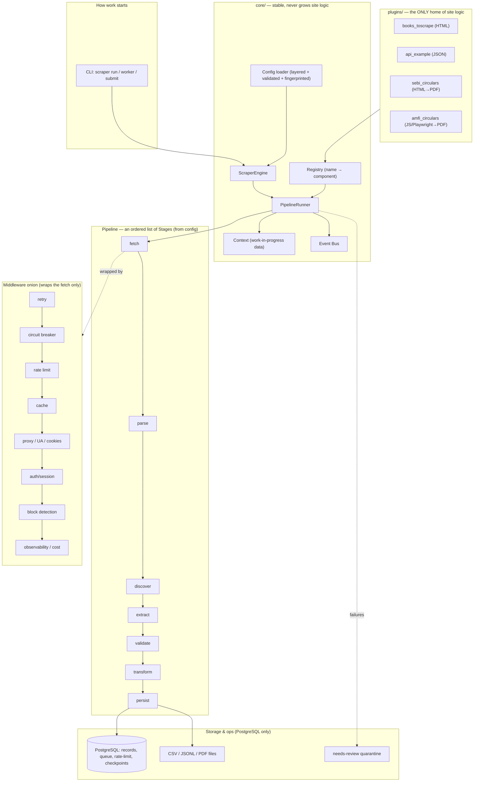
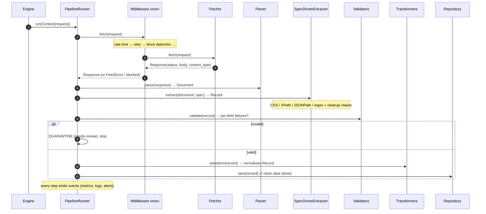
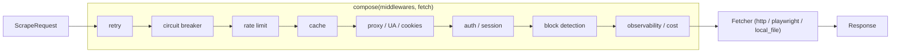
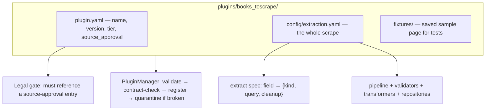
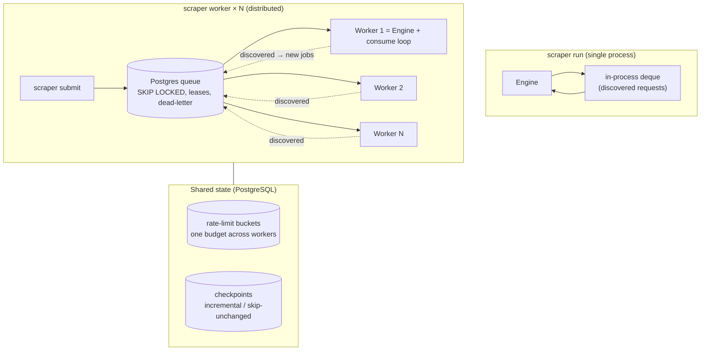
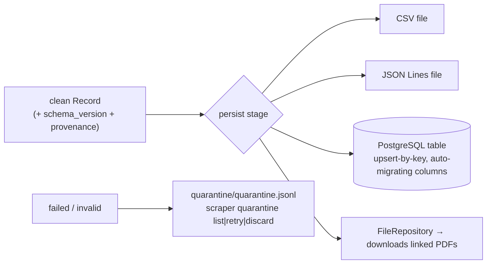
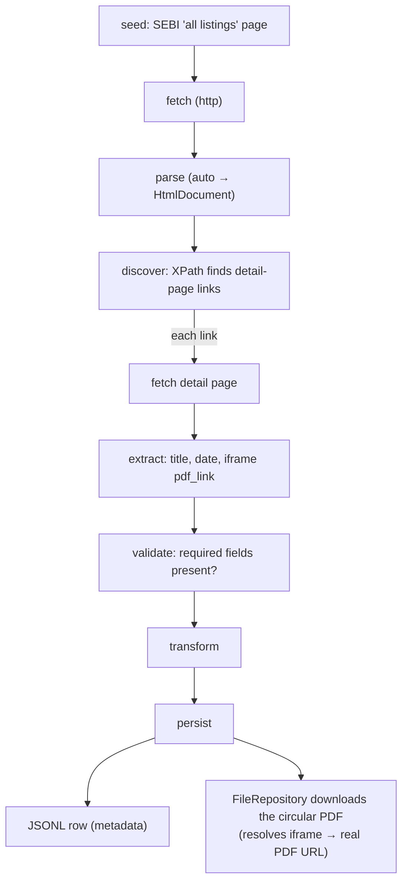

# Scraper Framework — Workflow & Architecture

A single-page tour of how the framework turns a **YAML config** into **clean,
stored records** — from one process on a laptop to N distributed workers, all
backed by PostgreSQL.

> **One-line mental model:** a small stable *core* runs a config-ordered list of
> *stages* over a *context*; every capability (fetch, parse, extract, validate,
> transform, persist, and cross-cutting concerns) is a *swappable component*
> behind a tiny contract; all site-specific knowledge lives only in *plugins*
> (usually just YAML). Adding a website = a config file, not a code change.

---

## 1. The big picture



**The invariant:** the Engine, Runner, Context, Registry, and Event Bus never
change as sites, stages, storage, or workers are added. All growth happens in
components and config.

---

## 2. The request lifecycle (one URL, end to end)

This is what happens to a single URL as it flows through the pipeline.



**Key guarantees along the way:**

- **Blocking looks like success** → a `block_detection` middleware classifies a
  200-that-is-really-a-CAPTCHA and rejects it *before* it reaches the parser.
- **Only clean data is stored** → records that fail validation go to the
  **quarantine** pile (with a full snapshot), never into your tables.
- **Provenance on every record** → which plugin+version, the exact config
  fingerprint, the source URL, and the timestamp travel with the data.

---

## 3. The middleware onion (cross-cutting concerns)

Everything around the fetch is *one* mechanism — an ASGI-style onion. Order is
config; first in the list is the outermost layer.



Why the order matters: **retry sits outside rate-limit**, so every retry
re-enters the stack and must take a rate-limit token — retries can never become
a storm. A blocked response raises a *permanent* error, which retry never
retries.

Tier presets pick the stack for you: `open` (minimal), `defended` (+circuit
breaker, UA rotation, cache), `hostile` (+proxy rotation, tightest limits).

---

## 4. The plugin model (where site logic lives)

A plugin is usually **just YAML** — no Python.



```yaml
# the heart of a plugin — pure config
extract:
  spec:
    title: { kind: css,   query: "div.product_main h1" }
    price: { kind: css,   query: "p.price_color", cleanup: [strip_currency, to_float] }
    sku:   { kind: xpath, query: "//table//tr[1]/td" }
```

- **Load-time safety:** selector kinds are checked against the parser's document
  capabilities when config loads — an XPath against a JSON API fails at startup,
  never at 2 a.m.
- **Broken plugins are quarantined**, never fatal — other plugins keep loading.
- **Legal gate:** a plugin can't target a real source without a recorded
  approval entry (`docs/source_approval.md`).

---

## 5. Single-process vs distributed (the same engine)

The identical engine runs one process or N workers — a config flag, not a code
change. In distributed mode, discovered pages (pagination/crawl) flow back
through the **Postgres queue** instead of an in-process deque.



- **No double-processing:** `SELECT … FOR UPDATE SKIP LOCKED` hands each job to
  exactly one worker.
- **Crash-safe:** a worker that dies mid-job has its lease expire and the job is
  redelivered — completed exactly once thanks to idempotent upserts.
- **One rate budget:** the token bucket lives in Postgres, so 4 workers on one
  domain still respect a single limit (no self-inflicted DDoS).
- **Incremental:** content hashing skips unchanged sources → near-zero fetching
  on a re-run.

---

## 6. Where the data goes



Every stored row carries `schema_version` plus full provenance
(plugin, version, config fingerprint, source URL, timestamp), so any record is
traceable to exactly how it was produced. Switching CSV → Postgres is a config
edit (`name: csv` → `name: postgres`), with credentials via `secret://` refs.

---

## 7. A concrete example: `sebi_circulars` (real regulator site)



Run it:

```bash
scraper run       plugins/sebi_circulars/config/extraction.yaml   # single process
scraper worker    plugins/sebi_circulars/config/extraction.yaml   # queue worker
scraper validate  plugins/sebi_circulars/config/extraction.yaml   # load-time checks only
scraper dry-run   plugins/sebi_circulars/config/extraction.yaml   # extract, print, store nothing
```

This one YAML file replaces a prior ~527-line hand-written Python scraper.

---

## 8. Component cheat-sheet

| Kind | Built-ins | Contract |
|---|---|---|
| **Fetcher** | `http`, `playwright`, `local_file` | `ScrapeRequest → Response` |
| **Parser** | `html`, `json`, `xml`, `pdf`, `text`, `auto` | `Response → Document` |
| **Extractor** | `spec_driven` | `Document + spec → Record` |
| **Validator** | `required_field`, `type`, `schema`, `business_rule`, `duplicate` | `Record → failures` |
| **Transformer** | `currency`, `date`, `text_cleaner`, `unit_converter`, `enum_mapper`, `field_enricher` | `Record → Record` |
| **Repository** | `csv`, `jsonl`, `postgres`, `file` (PDF) | `save(Record)` |
| **Middleware** | `retry`, `rate_limit`, `distributed_rate_limit`, `circuit_breaker`, `cache`, `proxy_rotation`, `ua_rotation`, `cookie_manager`, `block_detection`, `auth`, `observability`, `cost_tracker` | `(request, next) → Response` |
| **Queue** | `InMemoryQueue`, `PostgresQueue` | submit / claim / ack / nack |

`scraper list-components` prints the live registry plus loaded/quarantined plugins.

---

## 9. Design rules that keep it maintainable

1. **`core/` never gains site logic or implementations** — enforced by
   import-linter in CI, not by vigilance.
2. **One middleware mechanism** — no competing "hooks"/"chains".
3. **No `BaseScraper`** — extension is composition + config, never per-site
   subclasses.
4. **Format mismatches fail at config load**, never mid-scrape.
5. **PostgreSQL is the only datastore** — queue, rate limits, checkpoints, and
   records all live in Postgres; other backends remain drop-ins behind their
   contracts if ever needed.
6. **Every component ships with contract tests; every spec with a fixture.**
